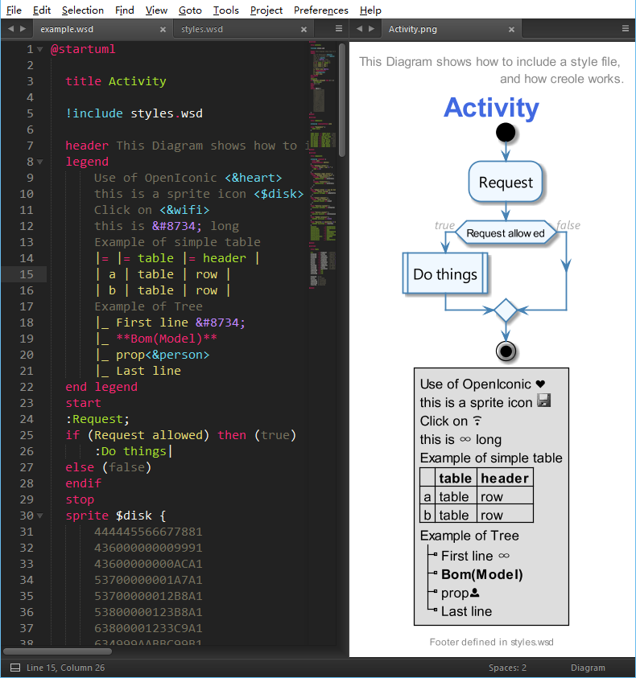
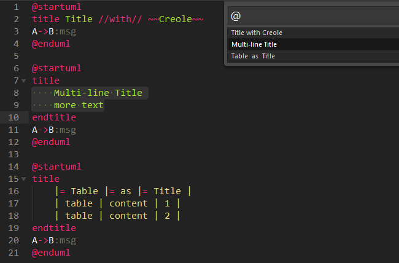
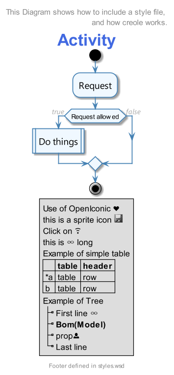
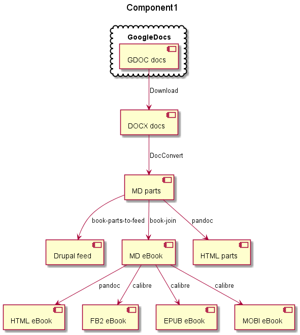
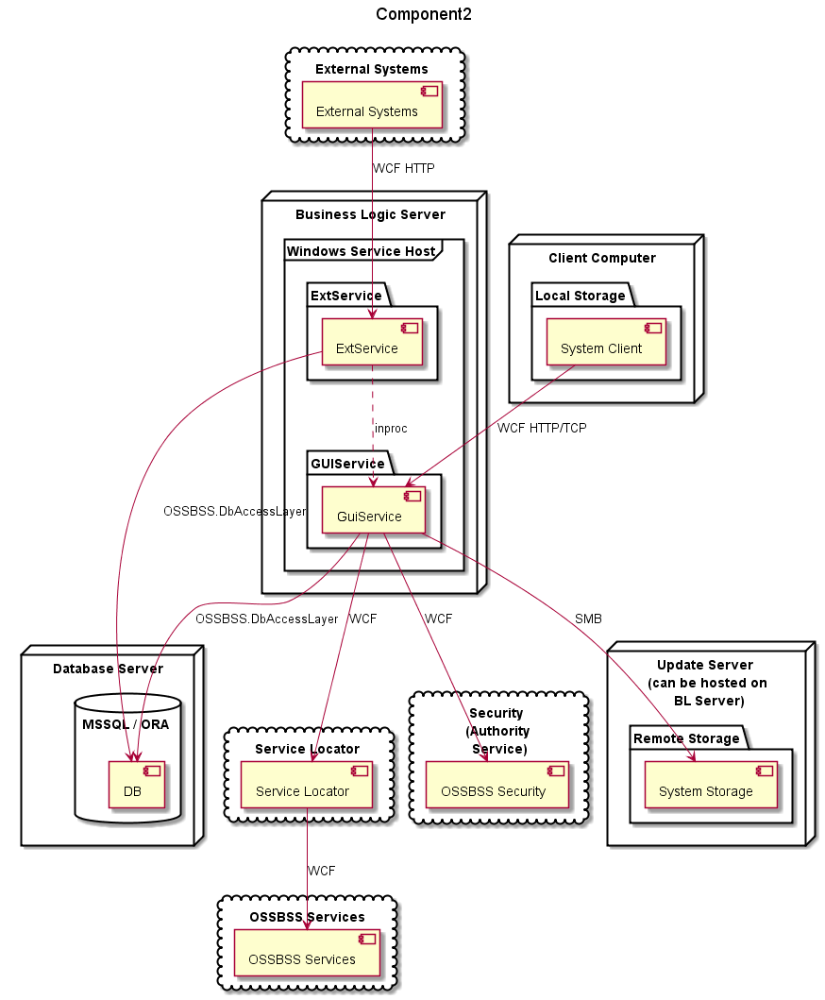
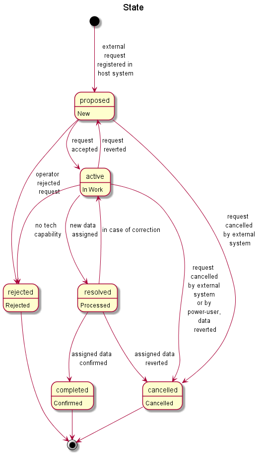
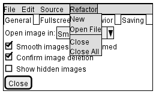

# Overview

This is a plugin that renders diagrams from your selection in Sublime Text 2
or 3.

By default, it binds the Alt-D key (preview diagram) and registers a command on the Command Palette. Place your cursor in your diagram or select lines of text and trigger the command. Multiselections are allowed. Multiselections are allowed.  

To generate diagrams, simplely press Ctrl-B, you will get diagrams in the same directory with source file.

If you wish to override the viewer used, disable start-time sanity checks, or
change the default character set for diagram files, search "Diagram Settings" in Command Palette, copy settings from "default settings" to "user settings", change any one as you wish.

## Install

To install from scratch, it's necessary to have:

* [Java][Java]
* [Graphviz][Graphviz]
* [Sublime Text 2 or 3][Sublime]
* [Diagram Plug-in][plugin]

[Java]: http://java.com/en/download/ "Download Java"
[Graphviz]: http://www.graphviz.org/Download..php "Download Graphviz"
[Sublime]: https://www.sublimetext.com/3 "Download Sublime Text"
[plugin]: #download "Where to download this plug-in"

To install, click menu **Preferences - Browse Packages..**, unzip the plugin (or put a checkout of this project for the original version) into the popup directory.

## Download

The source is available via git at:

<https://github.com/qjebbs/sublime_diagram_plugin.git>

Or as a tarball at:

<https://github.com/qjebbs/sublime_diagram_plugin/tarball/master>

## Support

Operating Systems:  MacOS X, Linux, Windows

Diagram Types: PlantUML

Viewers (in order of preference):

* Sublime3Viewer
* WindowsDefaultViewer
* QuickLookViewer
* EyeOfGnomeViewer
* PreviewViewer
* FreedesktopDefaultViewer

Patches to support additional viewers or diagrams are welcome.

# Modifications

This is a modified version from [jvantuyl](https://github.com/jvantuyl/sublime_diagram_plugin.git "https://github.com/jvantuyl/sublime_diagram_plugin.git")'s work.

- **Totally rewrite** the **syntax** file, full support of **all diagram types and salt**, including skinparam support for **styles**, inner **HTML**, and **Creole**.
- Add setting for output file **format**, available: **png**, **svg**, **eps**, **latex**.
- Add Diagram to **Build System**.
- In **preview** mode, diagrams are generated to %TEMP%/TempDiagrams. 
- **Include Preprocessing** support, such as "!include styles.wsd"
- **No more random** file name, and has generated diagrams more **neatly organized**.
- Add **Goto Symbol** support.
- Add **Sublime3Viewer** for viewing diagram images in sublime text 3. Thanks to [hardillb](https://github.com/hardillb "https://github.com/hardillb").
- Settings **take effect immediately**.
- Add Ctrl+/, Ctrl+Shift+/ **quick comment** support.
- Add part of snippets.
- PlantUML **Document** intergrated.
- Key binding, menu, command changes
- Brief console messages
- Option for automatic reload on save of already previewed file

## Operations

Press <kbd>Alt</kbd> <kbd>D</kbd> to preview.

Preview mode **tend to** preview the **current** diagram, unless you select part of a diagram (more the one line) or more than one diagram.

Press <kbd>Ctrl</kbd> <kbd>B</kbd> to build diagrams for current file.

Build Command **tend to** build **all** diagrams unless you select some of them or part of a diagram.

## Preview of new syntax  & Side by side viewing (multiple column)

This is a preview for activity diagram with "**Monokai Extend**" color scheme.

Side by side viewing is a more convenience way to edit plantuml diagrams. Each time you view the diagram, the result will refresh in the right one place, no popup window or new view.

**STEP 1**

*If you are using sublime text 3 and keep the default diagram plugin settings, you can ignore this step.*
{style=color:brown;}

Make sure you are using sublime text 3 and have followed settings:

    "viewer" : "Sublime3Viewer", 
    "format": "png" // png, svg, eps, latex

**STEP 2**

press <kbd>alt</kbd> <kbd>D</kbd> to preview diagram; press <kbd>alt</kbd> <kbd>shift</kbd> <kbd>2</kbd> to switch to 2 columns; drag the preview to new column.

## Preview of **Goto Symbol**

Press  <kbd>Ctrl</kbd> <kbd>R</kbd> to list all diagram titles in current file.

Perfectly deal with complex titles. Same process in using title as file name.

# Example Results

Activity

Component1

Component2

State

Salt

# Thanks

Special thanks to all of those who have contributed code and feedback,
including:

* Tobias Bielohlawek (Syntax Highlighting Support)
* Julian Godesa (UX Feedback)
* Seán Labastille (Preview Support, Multi-Diagram Support)
* Kirk Strauser (Python 3 / SublimeText 3 Support)
* Stanislav Vitko (PlantUML Updates)
* Constantine ? (Windows Viewer, Charset Support, Various Other Fixes)
* Marcelo Da Cruz Pinto (Windows Viewer)
* Peter Ertel (PEP8 Cleanup, Windows Improvements)
* Juan Cabrera (Version Updates)
